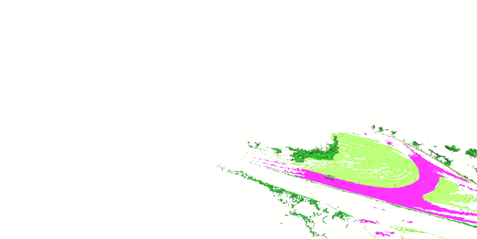
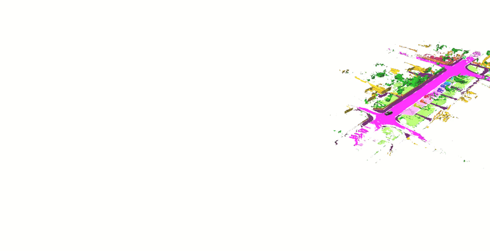

# Voxfield Panmap
Multi-resolution **pan**optic volumetric **map**ing based on [**panoptic_mapping**](https://github.com/ethz-asl/panoptic_mapping) using [**Voxfield**](https://github.com/VIS4ROB-lab/voxfield) as its mapping backbone. Please check our Voxfield paper for more details.

## Paper and Video 
[**1-min demo video**](https://youtu.be/sPNzTOLqb2I) | [**paper**](https://www.research-collection.ethz.ch/handle/20.500.11850/560719)


## Installation
It's the same as the original panmap. Please check the instructions from [here](https://github.com/ethz-asl/panoptic_mapping).

Build the repository by:
```
catkin build panoptic_mapping_utils
```

## Example Usage

Configure the parameters in the ```.yaml``` files in ```./panoptic_mapping_ros/config/mapper/```.

And then launch the mapper by:
```
roslaunch panoptic_mapping_ros run_[xxx_dataset].launch
```

Our Voxfield Panmap supports both the RGB-D and LiDAR input and provides some example experiments on datasets including ASL Flat, Cow and Lady, (Semantic) KITTI, Semantic USL, MaiCity, Newer College, etc.

## Demo on outdoor LiDAR datasets







## Citation
If you find this code useful for your work or use it in your project, please consider citing the following papers:
```
@inproceedings{pan2022iros,
  title={Voxfield: non-Projective Signed Distance Fields for Online Planning and 3D Reconstruction},
  author={Yue Pan, Yves Kompis, Luca Bartolomei, Ruben Mascaro, Cyrill Stachniss, Margarita Chli},
  booktitle={Proceedings of the IEEE/RSJ Int. Conf. on Intelligent Robots and Systems (IROS)},
  year={2022}
}

@inproceedings{schmid2022icra,
  title={Panoptic Multi-TSDFs: a Flexible Representation for Online Multi-resolution Volumetric Mapping and Long-term Dynamic Scene Consistency},
  author={Schmid, Lukas and Delmerico, Jeffrey and Sch{\"o}nberger, Johannes and Nieto, Juan and Pollefeys, Marc and Siegwart, Roland and Cadena, Cesar},
  booktitle={Proceedings of the IEEE International Conference on Robotics and Automation (ICRA)},
  year={2022}
}
```

## Acknowledgments
We thanks greatly for the authors of the following opensource projects:

- [panoptic_mapping](https://github.com/ethz-asl/panoptic_mapping)
- [Voxblox](https://github.com/ethz-asl/voxblox)
